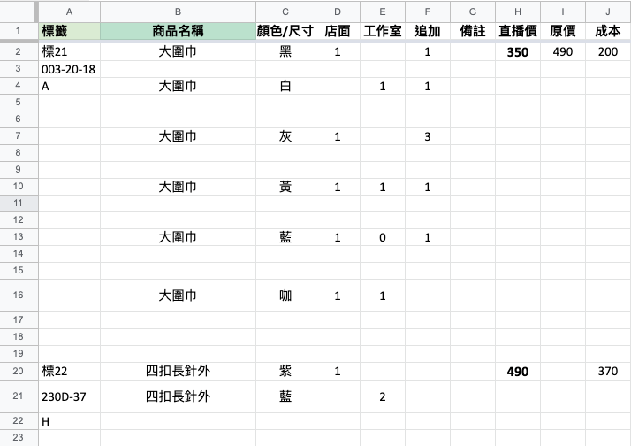
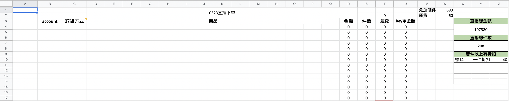
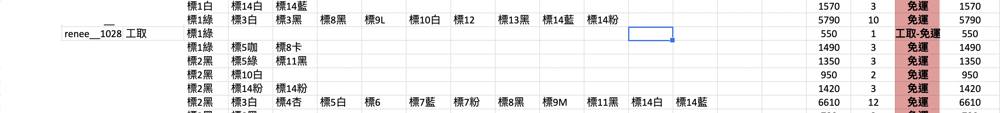
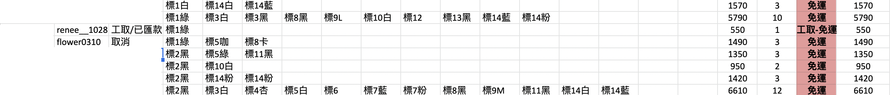
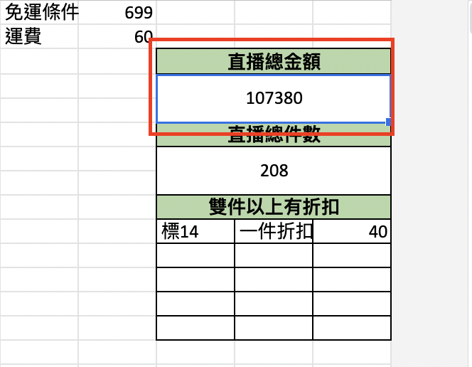
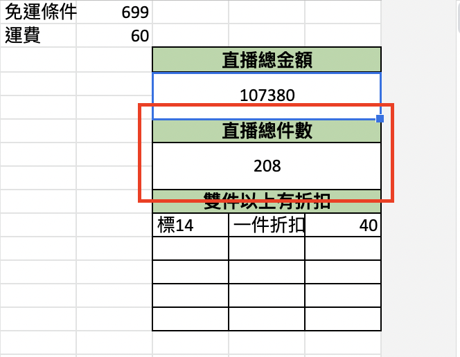
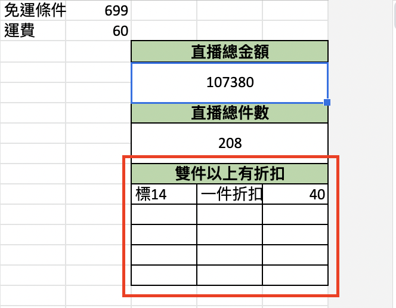

# 直播加單

## 事前準備事項

- [直播加單範本](https://docs.google.com/spreadsheets/d/11tHWJh-Dp7SdS9BokrPABPWi9eIjKc8qL9NZ3g_tDgc/edit#gid=1243175386)  
- 請將雲端表共用給 `bird06291994@gmail.com` 與 `eshop-live-streaming-count-clo@prime-sign-344412.iam.gserviceaccount.com`  

### 商品頁面

  

A 欄  

- 各商品的第一行必須填上標號 *e.g. 標1*  
- 其他行可以隨意備註貨號等資訊  

B 欄  

- 各顏色/尺寸的第一行必須在 B 欄填上商品名稱 *e.g. 大圍巾*  
- 其他行必須空白，不能有其他字符  

C 欄  

- 各顏色/尺寸的第一行必須填上顏色/尺寸 *e.g. 黑* ，如果有分尺寸請用 **/** 隔開 *e.g. 黑/S*  
- 其他行必須空白，不能有其他字符  

D 、 E 、 F 欄  

- 請依照對應欄位將數量與商品名稱、顏色\尺寸填寫在同一行  
- 該區塊只能填寫數字，如出現數字以外的字符，商品的顏色數量會計算為 0  
- 如果對應的欄位沒有數量可以空白就好，不需填 0 ，如以下範例 **高領襯衫 黑 總件數為 3**  
  
|商品名稱|顏色/尺寸|店面|工作室|追加|
|:--:|:--:|:--:|:--:|:--:|
|高領襯衫|黑|1||2| 

G 欄  

- 可以隨意針對商品的顏色尺寸做備註  

H 欄  

- 只能填數字  
- 以此金額計算直播業績，請確認金額是否正確  

J 欄

- 打錯會導致板娘可能對直播價及成本價有疑慮或算錯直播價，請確認金額是否正確  

### 下單頁面

  

A 欄  

- 只能填寫 IG 帳號的真實姓名或空白  

B 欄  

- 只能填寫 IG 帳號或空白  

C 欄  

- 該欄位開頭填寫 **店取** 或 **工取** ，後面的 **key 單金額** 就不會加運費  

  例如以下圖片上客人的訂單未達免運門檻，但有備註工取（工作室取貨），所以客人的 key 單金額不會加上運費  

    

- 可以當備註 *e.g. 店取/已匯款* 或 *e.g. 取消*  
  
  例如以下圖片上的範例，並不影響後面的金額  

  

W1 欄位  

- 免運門檻  

W2 欄位  

- 未達免運門檻的運費金額  

X4:Z5 欄位  

- R 棟訂單的加總  
  
    

X7:Z8 欄位  

- 總件數  
  
    

X10:Z14 欄位  

- 若雙件以上有固定折扣，請將標號填寫在 X10 欄位 ，金額填寫在 Z10 欄位  

  例如標14小可愛一件 $290 ，兩件 $500 ，三件 $750 ，四件 $1000，等於雙件以上小可愛單價為 $250 (單價便宜 40 元)，此情況可以將小可愛標號填寫在 X10 欄位 ，小可愛雙件以上的單價填寫在 Z10 欄位，即可正確計算出有買雙件以上的金額  

    

- 最多只可輸入五個標號  
- **若折扣的單價沒有等差，須針對有購買的客人自行計算正確金額**
